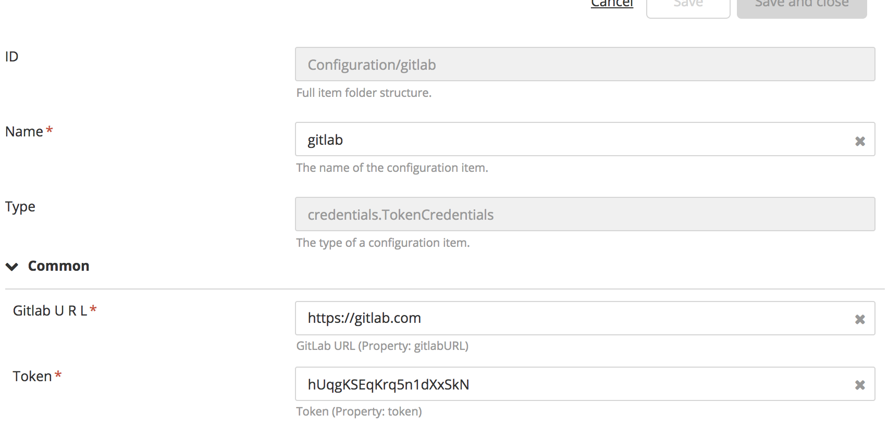
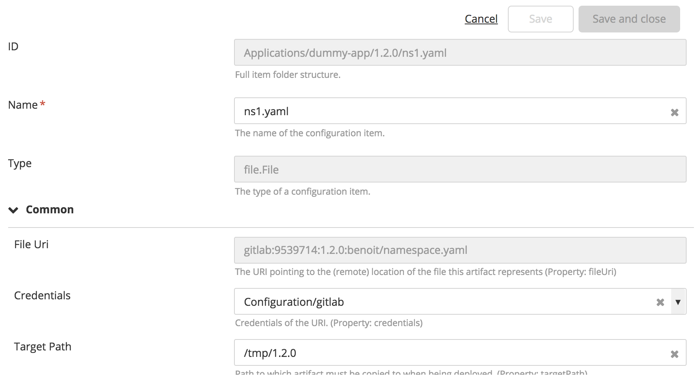

# XL Deploy GitLab artifact resolver plugin 

[![Build Status][xld-gitlab-artifact-resolver-plugin-travis-image]][xld-gitlab-artifact-resolver-plugin-travis-url]
[![License: MIT][xld-gitlab-artifact-resolver-plugin-license-image]][xld-gitlab-artifact-resolver-plugin-license-url]
![Github All Releases][xld-gitlab-artifact-resolver-plugin-downloads-image]

[xld-gitlab-artifact-resolver-plugin-travis-image]: https://travis-ci.org/xebialabs-community/xld-gitlab-artifact-resolver-plugin.svg?branch=master
[xld-gitlab-artifact-resolver-plugin-travis-url]: https://travis-ci.org/xebialabs-community/xld-gitlab-artifact-resolver-plugin
[xld-gitlab-artifact-resolver-plugin-license-image]: https://img.shields.io/badge/License-MIT-yellow.svg
[xld-gitlab-artifact-resolver-plugin-license-url]: https://opensource.org/licenses/MIT
[xld-gitlab-artifact-resolver-plugin-downloads-image]: https://img.shields.io/github/downloads/xebialabs-community/xld-gitlab-artifact-resolver-plugin/total.svg

## Preface

This document describes the functionality provided by the XL Deploy Artifact resolver plugin. it allows to set a gitlab reference in the 'File Uri' property of a deployable.
it works with a new kind of credentials than can be defined in the Configuration Node : `credentials.TokenCredentials`
The gitlab uri is : `gitlab:projectid:ref:file`. Example: `gitlab:9539714:1.2.0:benoit/namespace.yaml refers to 
* a gitlab server referenced into the `credentials.TokenCredentials`,
* the project id `9539714`
* the ref (tag) `1.2.0` (the  reference can be `master` but it is a bad practice)
* the file `benoit/namespace.yaml` in that repository.

See the [XL Deploy reference manual](https://docs.xebialabs.com/xl-deploy) for background information on XL Deploy and deployment automation concepts.  

## Overview

## Requirements

Note:  XLD version should not be lower than lowest supported version.  See <https://support.xebialabs.com/hc/en-us/articles/115003299946-Supported-XebiaLabs-product-versions>.

## Installation

* Copy the latest JAR file from the [releases page](https://github.com/xebialabs-community/xld-gitlab-artifact-resolver-plugin/releases) into the `XL_DEPLOY|RELEASE_SERVER/plugins` directory.
* Copy [java-gitlab-api-4.1.0.jar](http://central.maven.org/maven2/org/gitlab/java-gitlab-api/4.1.0/java-gitlab-api-4.1.0.jar) into the `XL_DEPLOY|RELEASE_SERVER/plugins` directory
* Restart the XL Deploy|Release server.

## Features

